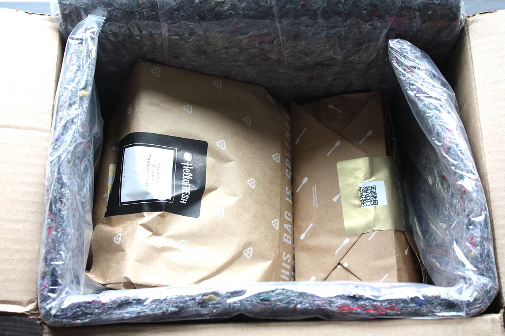
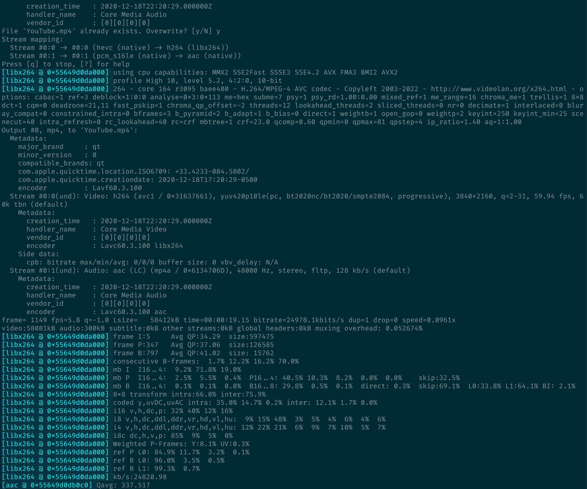
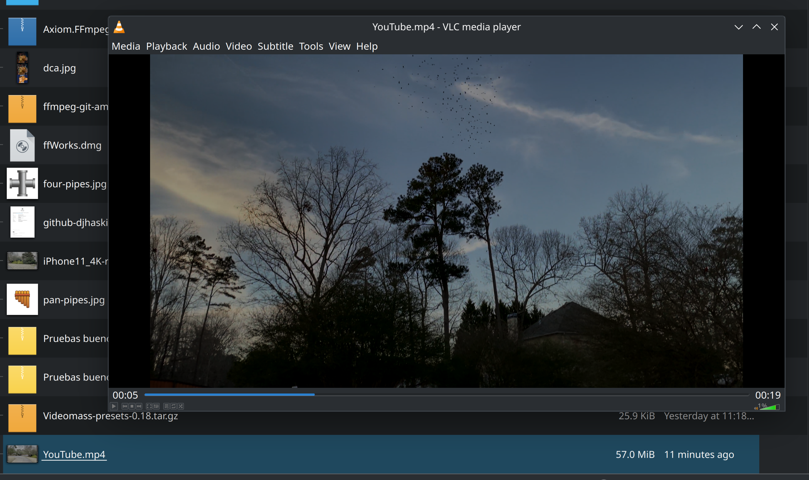

% Episode 1: Start Your Engines!
% Daniel Haskin
% October 3, 2023

# Episode 1: Start Your Engines!

## Get Super FFmpeg Powers

- HaxXOR's FFmpeg: `brew install ffmpeg`
- The People's FFmpeg: [Martin Riedl's FFmpeg Build Server](https://ffmpeg.martin-riedl.de/).
- Fedora Linux: RPMFusion + `dnf install ffmpeg`

# FFmpeg Can Make Meal Kits

## An MP4 File



[(link)](https://www.pcmag.com/reviews/hellofresh-meal-delivery-service)

# The Plan

1. Demux
2. Decode
3. "Do Stuff" to the food.
4. Encode
5. Mux

# Inspect the Asset

## You Do This

```
ffprobe -i ASSET
```

# Inspect the Asset

## Terminal Does This

```
ffprobe version 6.0 Copyright (c) 2007-2023 the FFmpeg developers
Input #0, mov,mp4,m4a,3gp,3g2,mj2, from '/home/danielhaskin/Downloads/iPhone11_4K-recorder_59.940HDR10.mov':
  Duration: 00:00:19.16, start: 0.000000, bitrate: 69140 kb/s
  Stream #0:0[0x1](und): Video: hevc (Main 10) (hvc1 / 0x31637668), yuv420p10le(pc, bt2020nc/bt2020/smpte2084), 3840x2160, 64166 kb/s, 59.92 fps, 59.94 tbr, 600 tbn (default)
    Metadata:
      handler_name    : Core Media Video
  Stream #0:1[0x2](und): Audio: pcm_s16le (lpcm / 0x6D63706C), 48000 Hz, 2 channels, s16, 1536 kb/s (default)
    Metadata:
      handler_name    : Core Media Audio
```

# Prepare the Asset

## The Plan

1. Demux the MOV
2. Decode audio/video
3. DON'T DO ANYTHING
4. Re-encode into AAC and x264
5. Mux into MP4

# Prepare the Asset

## Interactive Adventure

(drag and drop folder first)

```
ffmpeg -i iPhone11_4K-recorder_59.940HDR10.mov \
    YouTube.mp4 \
    -b:a 384k -c:a aac \
    -b:v 8M -c:v libx264 \
    -movflags +faststart -pix_fmt yuv420p
```

# Prepare the Asset

## Result



# Prepare the Asset

## YouTube Video



# Wait, What

(Questions/Comments)

# Verify the Asset

Inspect the YouTube.mp4 On Your Own

# See You Next Time

- Next Time: Subtitles.
