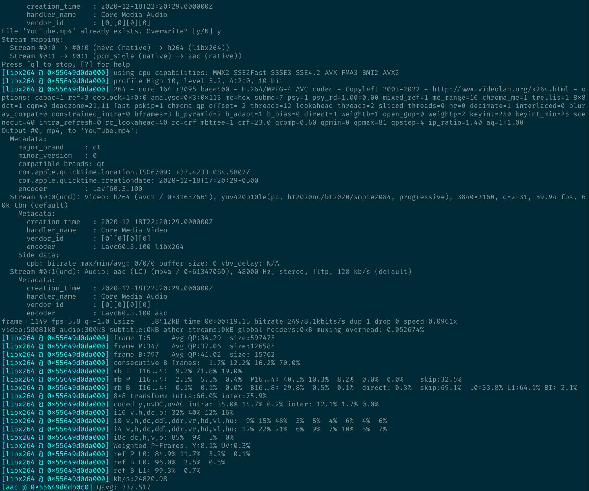

# Episode 1: Start Your Engines!

## Get Super FFmpeg Powers

OK, so, this episode thing. I guess we're doing a super hero story? Fantasy?
Whatever. At any rate we need to soup up your mac with Super FFmpeg Powers.

We can do this any number of ways, and your preference will matter here. So
let's do a little "Choose Your Own Adventure".

- You are a **haxXOR** who h4z the c0d3zz: `brew install ffmpeg`, see
  https://brew.sh/ .
- You are a **normal person** _who is hoping this will be as painless as possible_:
  for that, we'll have to go to some random back alley, a joint named
  [Martin Riedl's FFmpeg Build Server](https://ffmpeg.martin-riedl.de/).
  You install the `.pkg` file for `ffmpeg` and `ffprobe`, and you're good to go :)
- BLACK DIAMOND: You are on a Fedora Linux box: Use RPMFusion to `dnf install
  ffmpeg`.

(That's all I got. I'm certain there's an `apt-get install -y ffmpeg` somewhere
for you Ubuntu Linux folks, but I'm not on such a machine at the moment so I
wouldn't know. :P)

Let's say you've gone through whatever adventure above suits best your fancy.

Cool.

Now FFmpeg isn't an "Application" in the normal sense. You can't find it in
"Applications" in Finder. It's more of an indy tool. Digs the underground scene.
To use it, we'll need to open up an application called "Terminal".

It's a pretty scary window, but hey, super hero shows need conflict.

Don't worry! We'll walk through everything together. That's why we're all here!

## FFmpeg Can Make Meal Kits

To use our FFmpeg powers, we need to understand how it works.

With great power comes great responsibility.

An asset is like food. Really. Every video you've probably ever watched from a
phone or computer in your life kinda looks the same when you take it apart. It
looks like one of them meal kit company kits. You open the box, and there's a
bunch of food inside, each individually wrapped.


[(link)](https://www.pcmag.com/reviews/hellofresh-meal-delivery-service)

Only, there's _all sorts_ of different food in different assets. Some are
dehydrated and tiny, others are full-blown fully-cooked meals that just have
saran wrap on top of them. The "food" is the actual video's contents, and the
free drink that comes with the meal is the actual video's audio. Sometimes the
meal even comes with a spoon and fork, which is like the video's subtitle track!
Am I getting too carried away? I feel like this analogy business has gone far
enough.


With that said, each asset has the following parts:

1. Outside box. This is called a "container".
2. Each thing in the box is called a "stream". Each "stream" (edible thing) is
   individually wrapped full-on "Hello Fresh" style.
3. Each wrapped stream is in a particular "format". Format means just what it
   says, but we don't usually talk about "food format". Instead, we usually say
   "cooking style". Dehydrated, pre-cooked, raw, without the salt, with salt
   separetly wrapped, whatever. These are all food formats, and it's kinda like
   the stream format. This is called a "codec" or "encoding". It's how the
   computer writes and reads the audio or video.

Assets can have as many streams (things in the box) as they like! Mulitple audio
tracks, multiple _video_ tracks, multiple _subtitle_ tracks, etc. They just
_usually_ have a knife, fork, spoon (subtitles stream), a drink (audio stream),
and an entre (video stream).

What does that matter to us? Well, Angel Studios is kinda like a trail mix
company. (I said I'd be done with the analogies. I guess I was wrong.) We
provide assets that are really small and easy to watch on-the-go. They have to
be! If they weren't, you couldn't watch a normal video with normal internet. The
video would be too big!

So we have to take a bunch of BIG assets and turn them into small, easy-to-eat
ones.

FFmpeg is like a master chef. It can take the things out of an asset, change
them/cook them, re-wrap the food, and put it back into another box for shipment.

Let me say those steps again, because anything FFmpeg can do has to do with
them. FFmpeg can:

1. Take streams (food) out of an asset container. This is called "Demuxing".
2. Decode streams (rehydrate them, cook them, make them edible).
3. "Do Stuff" to the raw streams. (COOL STUFF, I promise.) This is called
   "Filtering".
4. Re-encode them however you want.
5. Put them back in another box. This is called "Muxing".

Remember, encoding is like how the food is prepared. Is it powdered? Is it all
one massive Cliff Bar brick? Is it ready-to-eat as-is? Is it piping hot and
comforting on a crisp autumn day?

Why do we care about how things are re-encoded? Well, _YouTube_ cares. (YouTube
is a very picky eater.)

## Inspect the Asset

Enough with exposition! Time for _action_.

We're now going to prepare an asset for upload to YouTube.

YouTube has some pretty
[stringent requirements](https://support.google.com/youtube/answer/1722171?hl=en#zippy=%2Ccontainer-mp%2Caudio-codec-aac-lc).

But that's okay! I already read them for you!

The first thing we need to grab is an asset. If you have one, fantastic! This
part will be easy. If you don't, hit [this sample video](https://drive.google.com/file/d/1Ic9DZXMSo07EJMqCFaQRKSSrSw6y1mYv/view?pli=1).

The second thing to do is hit `CMD+Space` and type "Terminal" to open the
Terminal app.

The third thing to do is open up that text file I sent that comes with this
super exciting episode!

Each recipe in the file loooks like this:

```
how-to: "do \
    this"
```

If that were the recipe in the file, and the instructions say "pull the `how-to` recipe into
the terminal", you should grab
what's in quotes and drag-and-drop it into the terminal. So, you should select this part
and drag-and-drop it into the terminal:

```
do \
    this
```

With your asset downloaded and your Mac equipped with FFmpeg, we can now
Do The Thing.

First, the asset. Let's see what is inside this very fresh box:

1. Find the asset in Finder.
2. Copy the asset to the clipboard (or its path).
3. Delete the `ASSET` word out of the `inspect-asset` recipe in the text file
   and paste the asset path in its place.
4. Drag-and-drop the `inspect-asset` recipe into the terminal window.
6. Click on the terminal window and press `<Enter>`.

Now you should see, like, way too much information in the terminal window:

```
ffprobe version 6.0 Copyright (c) 2007-2023 the FFmpeg developers
  built with gcc 13 (GCC)
  configuration: --prefix=/usr --bindir=/usr/bin --datadir=/usr/share/ffmpeg --docdir=/usr/share/doc/ffmpeg --incdir=/usr/include/ffmpeg --libdir=/usr/lib64 --mandir=/usr/share/man --arch=x86_64 --optflags='-O2 -flto=auto -ffat-lto-objects -fexceptions -g -grecord-gcc-switches -pipe -Wall -Werror=format-security -Wp,-U_FORTIFY_SOURCE,-D_FORTIFY_SOURCE=3 -Wp,-D_GLIBCXX_ASSERTIONS -specs=/usr/lib/rpm/redhat/redhat-hardened-cc1 -fstack-protector-strong -specs=/usr/lib/rpm/redhat/redhat-annobin-cc1 -m64 -mtune=generic -fasynchronous-unwind-tables -fstack-clash-protection -fcf-protection -fno-omit-frame-pointer -mno-omit-leaf-frame-pointer' --extra-ldflags='-Wl,-z,relro -Wl,--as-needed -Wl,-z,now -specs=/usr/lib/rpm/redhat/redhat-hardened-ld -specs=/usr/lib/rpm/redhat/redhat-annobin-cc1 -Wl,--build-id=sha1 ' --extra-cflags=' -I/usr/include/rav1e' --enable-libopencore-amrnb --enable-libopencore-amrwb --enable-libvo-amrwbenc --enable-version3 --enable-bzlib --enable-chromaprint --disable-crystalhd --enable-fontconfig --enable-frei0r --enable-gcrypt --enable-gnutls --enable-ladspa --enable-libaom --enable-libdav1d --enable-libass --enable-libbluray --enable-libbs2b --enable-libcdio --enable-libdrm --enable-libjack --enable-libjxl --enable-libfreetype --enable-libfribidi --enable-libgsm --enable-libilbc --enable-libmp3lame --enable-libmysofa --enable-nvenc --enable-openal --enable-opencl --enable-opengl --enable-libopenh264 --enable-libopenjpeg --enable-libopenmpt --enable-libopus --enable-libpulse --enable-libplacebo --enable-librsvg --enable-librav1e --enable-librubberband --enable-libsmbclient --enable-version3 --enable-libsnappy --enable-libsoxr --enable-libspeex --enable-libsrt --enable-libssh --enable-libsvtav1 --enable-libtesseract --enable-libtheora --enable-libtwolame --enable-libvorbis --enable-libv4l2 --enable-libvidstab --enable-libvmaf --enable-version3 --enable-vapoursynth --enable-libvpx --enable-vulkan --enable-libshaderc --enable-libwebp --enable-libx264 --enable-libx265 --enable-libxvid --enable-libxml2 --enable-libzimg --enable-libzmq --enable-libzvbi --enable-lv2 --enable-avfilter --enable-libmodplug --enable-postproc --enable-pthreads --disable-static --enable-shared --enable-gpl --disable-debug --disable-stripping --shlibdir=/usr/lib64 --enable-lto --enable-libvpl --enable-runtime-cpudetect
  libavutil      58.  2.100 / 58.  2.100
  libavcodec     60.  3.100 / 60.  3.100
  libavformat    60.  3.100 / 60.  3.100
  libavdevice    60.  1.100 / 60.  1.100
  libavfilter     9.  3.100 /  9.  3.100
  libswscale      7.  1.100 /  7.  1.100
  libswresample   4. 10.100 /  4. 10.100
  libpostproc    57.  1.100 / 57.  1.100
Input #0, mov,mp4,m4a,3gp,3g2,mj2, from '/home/danielhaskin/Downloads/iPhone11_4K-recorder_59.940HDR10.mov':
  Metadata:
    major_brand     : qt  
    minor_version   : 0
    compatible_brands: qt  
    creation_time   : 2020-12-18T22:20:29.000000Z
    com.apple.quicktime.creationdate: 2020-12-18T17:20:29-0500
    com.apple.quicktime.location.ISO6709: +33.4233-084.5802/
  Duration: 00:00:19.16, start: 0.000000, bitrate: 69140 kb/s
  Stream #0:0[0x1](und): Video: hevc (Main 10) (hvc1 / 0x31637668), yuv420p10le(pc, bt2020nc/bt2020/smpte2084), 3840x2160, 64166 kb/s, 59.92 fps, 59.94 tbr, 600 tbn (default)
    Metadata:
      creation_time   : 2020-12-18T22:20:29.000000Z
      handler_name    : Core Media Video
      vendor_id       : [0][0][0][0]
      encoder         : HEVC
  Stream #0:1[0x2](und): Audio: pcm_s16le (lpcm / 0x6D63706C), 48000 Hz, 2 channels, s16, 1536 kb/s (default)
    Metadata:
      creation_time   : 2020-12-18T22:20:29.000000Z
      handler_name    : Core Media Audio
      vendor_id       : [0][0][0][0]
```

FFprobe, eh, he's alright, but he's a _talker_. I did _not_ need to know all
that.

But some parts of the conversation were, in fact, interesting. Let's go through
them.

```
Input #0, mov,mp4,m4a,3gp,3g2,mj2, from '/home/danielhaskin/Downloads/iPhone11_4K-recorder_59.940HDR10.mov':
```

That means ffprobe found your video and saw that the "box type" was a MOV file.

```
  Duration: 00:00:19.16, start: 0.000000, bitrate: 69140 kb/s
```

Cool, now we know the bitrate and length of the asset.

```
  Stream #0:0[0x1](und): Video: hevc (Main 10) (hvc1 / 0x31637668), yuv420p10le(pc, bt2020nc/bt2020/smpte2084), 3840x2160, 64166 kb/s, 59.92 fps, 59.94 tbr, 600 tbn (default)
```

There's that "Stream" word. It's an individually wrapped video stream, yummy!
It's inside the `mov` box. Oooh, and there's that `3840x2160` in there too,
so we know that this asset is 4K.

It also says `59.92 fps`, or "frames per second". (That's kinda fast, but it
works.)

```
  Stream #0:1[0x2](und): Audio: pcm_s16le (lpcm / 0x6D63706C), 48000 Hz, 2 channels, s16, 1536 kb/s (default)
```

Hey, it's got an audio track too! Cool! It's `2 channels`, so that's stereo, and
it has bitrate and sample rate too, whatever that means!

I told you that assets have a subtitle track too. They can, but this one
doesn't.

## Prepare the Asset

Now we'll tell FFmpeg to process the asset. Recall that FFmpeg can:

1. Take streams (food) out of an asset container.
2. Decode them (rehydrate them, cook them, make them edible).
3. "Do Stuff" to the food.
4. Re-encode them however you want.
5. Put them back in another box.

So now we'll tell it to:

1. Take the stream out of the asset MOV container.
2. Decode the audio and video tracks to get the "raw" footage.
3. We actually won't tell it to "Do Stuff" today. We'll do that next time!
4. Re-encode (re-cook) the audio into AAC (20oz), and the video into x264
   (trail-mix).
5. Put them into an MP4 box.

YouTube, man! So picky! It _has_ to have its 20oz drink, it _has_ to have its
trail mix. It's even picky about the lunch box!

To tell it to do this:

1. Make sure you have a Terminal window open.
2. Click on the window and hit `<Enter>` a bunch of times in your terminal
   window to clear it out.
3. Open Finder and navigate to the folder you want FFmpeg to put the YouTube
   video in.
4. Drag the folder that you want the video put in into the terminal window.
   Click the window and hit `<Enter>`. (If that doesn't work, right-click on the
   folder and hit "Copy", then right-click on the Terminal window and hit
   "Paste", followed by `<Enter>`.)
5. Right-click the asset you downloaded earlier, and select "Copy".
5. Delete the `ASSET` word from the `prepare-for-youtube ` recipe and paste in
   the file you want to process in its stead.
6. Select the whole recipe (inside the quotes, not including them) and copy them
   to the clipboard.
7. Right-click the terminal window and select "Paste".
8. Click into the Terminal window and hit `<Enter>`.

Your terminal window should start kinda freaking out now. If you did the magical
incantation right, your window should start telling you "Okay! I'm working!".




At the end, you should have a brand new `YouTube.mp4` asset! That YOU made!


Congratulations!

(I promised you could do several assets all at once. You totally can! But we
should learn that later. For now, that's how to use FFmpeg.)

## Wait, What

That was cool and all, but this "episode" is supposed to be at least _mildly_
educational, so let's break down that recipe you just used.

Here's the translation:

1. Call FFmpeg on an asset. Demux the asset (open up the box) and decode it:
   `ffmpeg -i ASSET \`
2. Use it to make a new video called "YouTube.mp4": `YouTube.mp4 \`
3. Encode its audio at 384 kbits/sec and use AAC audio encoding (YouTube
   specifically asks for this): `-b:a 384k -c:a aac \`
4. Encode the video at 8Mbits/sec and use x264 video encoding ("Make the asset
   smol for phones"): `-b:v 8M -c:v libx264 \`
5. Lastly, `-movflags +faststart -pix_fmt yuv420p`: Put meta video information at the front of the file ("Put a label on the box so it's
   easy to know what's inside). That's the `movflags` part. Also, encode ("cook") the
   video with a specific pixel format so that it's _smol_ and easy for phones to
   download (the `pix_fmt` part).

That's about it, but y'all probably have more questions. That's cool! Just hit
me up and I can answer any questions you have.

## Verify the Asset

As part of the adventure, try to do the `inspect-asset` stuff above on the
`YouTube.mp4` asset. Verify that the bitrate, framerate, and sample rate are all
up to snuff for YouTube!

## See You Next Time

The next classes are going to dive deeper into those things FFmpeg can do:

- "Do Stuff" to the food: next time, we'll learn how to burn in subtitles and
  crop video (adjust its aspect ratio) to five assets at once!

